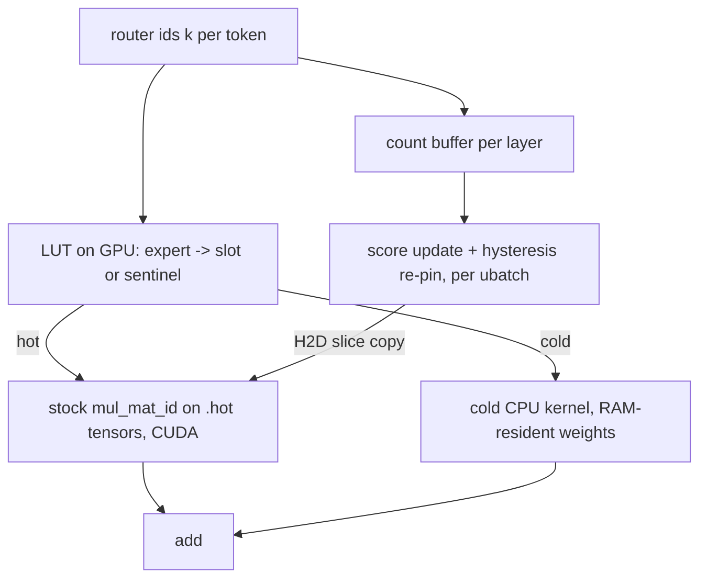

# Architecture: llama-wackMall expert-granular MoE tiering engine

First public disclosure: 2026-07-26. This document is published to disclose
the methods and systems described herein as of that date, with the intent
that this disclosure serve as prior art. Code and document are MIT licensed;
the authors grant no patent rights and intend none to be asserted over the
disclosed concepts.

Design rule: all model-specific knowledge lives in data (seed files), never
in code. Hooks exist only at the shared MoE graph-builder level
(build_moe_ffn / build_lora_mm_id), so every mechanism below applies to any
llama.cpp MoE architecture with the standard ffn_{gate,up,down}_exps tensor
layout. No per-model branches.

---

## 1. System overview

A sparse MoE layer routes each token to k of N experts. Stock llama.cpp
offloads whole layers; on small GPUs most experts end up on CPU and every
token streams its k active experts from RAM (~25 MB/token for a 122B-class
model), which sets the speed floor.

This engine tiers experts individually: a small set of hot experts lives in
VRAM, the rest stay RAM-resident and are computed on CPU only when routed.
Per-token traffic becomes (cold-selected unique experts) x (bytes/slot)
instead of (all active experts) x (bytes/slot).

## 2. Hot store layout and the sentinel trick

Per MoE layer and per weight matrix (gate, up, down):

- `.hot` tensor [ne0, ne1, S+1] on GPU: S hot expert slices plus one
  zero-filled sentinel slot at index S.
- `lut` int32[N] on GPU: lut[e] = slot index if expert e is hot, else S.
- Graph rewrite for small graphs: ids_hot = get_rows(lut, ids), then the
  stock mul_mat_id runs on the .hot tensor with ids_hot. Cold selections
  map to the zeroed sentinel, contributing an exact zero:
  SWIGLU: silu(x*0) * (x*0) = 0; GELU variant: gelu(x*0) * (x*0) = 0.
  No masking, lossless by construction.

Because selection affects only which slot is read, placement changes speed,
never logits.

## 3. Cold execution paths (two kernels + one counter)

a) MUL_MAT_ID_COLD (generic, per-matrix). CPU op with the same I/O layout
as stock mul_mat_id. Computes only experts that are both selected and cold
(dedup inside the op), writes zeros for hot rows; a ggml_add merges with the
GPU result. Used for SWIGLU architectures; all published benchmarks ran
through this path.

b) MOE_COLD (fused 3-phase, gated). For architectures with fused gate_up
blocks, GELU-family activation, and no per-expert biases:
- Phase A: prefetched vec_dot over unified gate_up slices
  (__builtin_prefetch into L1).
- Phase B: multithreaded activation across the thread pool (SWIGLU or
  tanh-approximated GELU on float).
- Phase C: non-overwriting accumulation dst[j] += result_j.
Eligibility is checked per layer at graph build (cold_ok); ineligible
architectures fall back to (a) with no model-specific code.

c) MOE_COUNT (count-only). The tiered kernels engage only for graphs of at
most TMAX tokens (default 16, the decode regime; larger prompt graphs keep
the stock path, which is already GPU-efficient). MOE_COUNT is a count-only
CPU op attached to large graphs that harvests router decisions into the same
per-layer count buffer, so prompt processing still feeds adaptation.

All three are registered ggml CPU ops with explicit get_n_tasks cases.

## 4. Hardware-aware auto-fit

Three-stage init at context creation:

1. Dense (non-expert) weights placed by the fit mechanism.
2. KV cache and compute buffers allocated.
3. Tier init measures the physically free VRAM and sets

   S = clamp( floor( (V_free - 512 MB) / bytes_per_slot ), 0, N_experts )

   with bytes_per_slot derived from the actual tensor quantization. S is
   uniform across layers; manual override via LLAMA_EXPERT_S. The 512 MB
   flat reserve covers runtime allocations (CUDA graph capture buffers are
   allocated after measurement). A manually forced S is clamped to what
   fits rather than failing at capture time.

`-cmoe` additionally auto-configures batch/ubatch 256, flash attention, KV
offload, np=1, and threads: when the dense (non-expert) weights fit the
GPU, 80% of hardware threads (the CPU then only streams cold experts);
otherwise the stock default. Manual -t always takes precedence.

## 5. Online adaptation (the cache policy)

Graphs are built once and reused, so the learning hook is not in the graph:
it runs after each graph_compute at ubatch granularity.

- Counting: the cold kernels increment counts[expert] (plus a total); the
  hook consumes and zeroes them.
- Score: score[e] = score[e]*decay + count[e]. decay defaults to 1.0
  (pure cumulative); values < 1 recency-weight.
- Re-pin: per layer, hottest cold expert ec replaces coldest hot slot si
  iff score[ec] > 1.5 * score[slot_expert[si]] AND the incumbent has dwelt
  >= 32 updates. Empty slots fill first. The swap copies one expert slice
  host-to-device per weight matrix and rewrites lut/mask contents only, so
  it is safe on reused CUDA graphs.
- Warm start: optional heat CSV via LLAMA_EXPERT_HOT; LLAMA_EXPERT_USAGE
  dumps counts at exit, reusable as the next session's seed
  (cross-session learning).

Correctness gates used during development: perplexity pairs (>= 9 chunks;
tiered within rounding noise of stock), bit-exact controls through
identical compute paths (tiering off / all-CPU), and a permanent invariant
guard that verifies lut/mask/slot bookkeeping after each run's re-pins.
The tiered path rounds differently than stock (different ops on different
backends), so greedy outputs can tie-flip; quality is equivalent within
measurement noise.

## 6. Integration invariants (the non-obvious parts)

- mm_ids_helper assumed at most one use of an expert per token; sentinel
  duplicates violate that. Fixed to count+rank semantics in both the
  template and generic paths, with shared memory sized
  n_tokens * n_expert_used.
- The CUDA scheduler anchors pass-1 weights only on buffers with usage
  WEIGHTS; hot buffers must be explicitly tagged or they get swept to CPU.
- mmq mul_mat_id receives ncols_max = n_tokens upstream ("no expert gets
  more columns than tokens"); the sentinel absorbs up to
  n_expert_used * n_tokens columns, so ncols_max is relaxed only for
  tensors with the .hot name suffix. Stock keeps the tight bound.
- Dispatch follows the src0 buffer: hot tensors in CUDA buffers execute on
  GPU at any batch size; cold host-pinned tensors stay on CPU.

## 7. Verified benchmarks

RTX 3070 8 GB VRAM, 31 GB RAM, --temp 0, -n 256 --ignore-eos, single run
per config. All numbers measured manually by the authors.

| Model | Quant | Stock | wackMall | Win |
|---|---|---|---|---|
| Qwen3.6-35B-A3B | IQ2_M (11 GB) | 27.74 tok/s | 63.54 tok/s (S=112) | +129% |
| Qwen3.6-35B-A3B | Q4_K_M (20 GB) | 26.89 tok/s | 49.93 tok/s (S=64) | +86% |
| gemma-4-26B-A4B | Q5_K_S (17 GB) | 19.50 tok/s | 25.62 tok/s (S=42) | +31% |
| Qwen3.5-122B-A10B | IQ2_M (28 GB) | ~8.0 tok/s (best layer-split) | 10.60 tok/s (S=28) | +33% |
| Long context (67k prompt) | - | CUDA OOM | 410.38 tok/s prompt eval | runs cleanly |
| Qwen3.5-122B, 16 GB RAM cap | IQ2_M (28 GB) | stock OOM | 5.08 tok/s | runs cleanly |

## 8. Disclosed directions (not yet implemented)

Published here as part of the same disclosure:

- Disk as third tier for models exceeding RAM: mmap the model and let the
  OS page cache be the RAM tier; hot slots and adaptation unchanged, cold
  CPU reads fault through the cache. MADV_RANDOM on expert tensors,
  major-fault cost in the stats dump, warmup page-in-storm mitigation
  (cap/reorder warmup touch pattern). Fallback: explicit warm-RAM store
  with two-level eviction.
- PILOT lookahead prefetch: apply the layer L+1 router to the layer L
  post-attention hidden state to predict upcoming expert selections
  (measured ~71.6% top-8 recall on the 122B) and prefetch into free slots.
- Per-layer slot skew: allocate S per layer by heat concentration instead
  of uniformly.
- Multi-GPU tier priority: per-tier .hot tensors, lut encodes tier+slot
  (Vulkan backend verified for the required quantized mul_mat_id types).

---

MIT License. See LICENSE.
